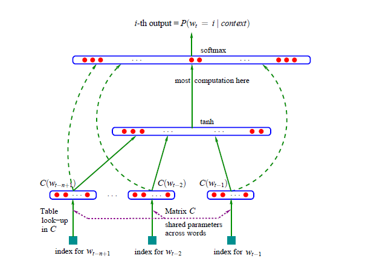
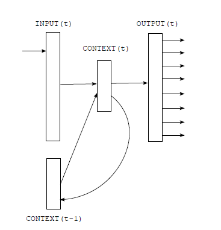
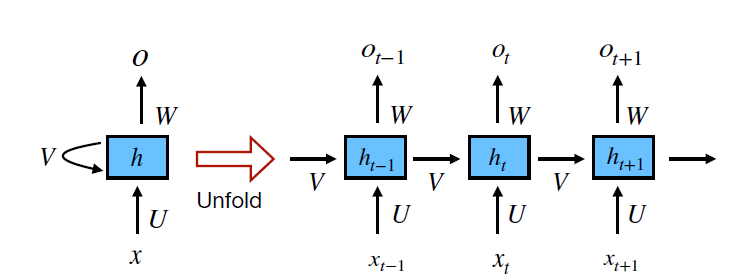

### RNN Language Model in NLP Tasks
Steven Su 
November 15, 2020
 
 
#### Introduction
Presently, artificial neural networks (ANN) are a common technique used in natural language processing (NLP) tasks.  They have made significant advances over traditional n-gram language models.  The natural question is, why is this so?  In this paper, I will provide some insight into this question and give a brief summary of early influential studies of ANN in NLP along with recent advances. 
 
#### Discussion 
##### Early Studies 
A relatively early study in 2003 by Bengio et al [1] reported significant advances using ANN over trigram language model with smoothing (Jelinek and Mercer, 1980) and also back-off n-gram models with the Modified Kneser-Key algorithm.  Comparative experiments were performed on what is called the Brown corpus which comes from a variety of English texts and books.  Another set of experiments were conducted using text from the Associated Press (AP) from 1995 and 1996.   In each case the ANN outperformed the n-gram based methods.  For the Brown corpus the perplexity test data improvement was 24% and for the AP corpus the imrovement was 8%.  To accomplish this Bengio et al used a fixed window neural network with multiple hidden layers (tanh) and  softmax output.  Additionally, they used what they called a learned distrubuted feature vector which appears to be what is commonly called a word embedding.  This is a method to represent words in vector space much more compactly and with greater representation as opposed to one hot vectorization.  Words with similar meaning have similar vector magnitudes and when vectors are added they can approximate the composite term, for example, when the vectors for capitol and France are added they can approximate the vector which represents Paris.  These word embeddings serve as input into the neural network and the conditional probability of the expected word, w, is the output.  The diagram of this network is shown in figure 1.   
 
 

 
*figure 1.  ANN used by Bengio et al [1]*
 
 
Later in 2010 Mikolov et al [2] used a more advanced ANN called a recurrent nerual network (RNN).   This has the advantage of not being limited to a set number of word inputs like the one used by Bengio et al.[1].  RNNs can be thought to operate in time steps where the word inputs are fed and processed serially.  The input length does not have to be predefined.  It also has the advantage of being able to “remember” using past information to process the next word in the current time step.  An illustration of this network can be seen in figure 2.  The loop back feature from time t to t-1 in the layer called context gives this ability.  This is sometimes called the hidden layer and is responsible for the bulk of the necessary computations.  To compare performance between the RNN and n-gram based methods, Mikolov et al. [2] used Wall Street Journal data sets, DARPA WSJ’92 and WSJ’93, in speech recognition tasks.  For the RNN model, they used what is called an Elman network and for the n-gram based model they used a Kneser-Ney smoothed 5-gram.  Other models were investigated but are not discussed here.  The RNN model showed a 18% improvement in word error rate (WER) against the n-gram model.  More significantly, the RNN model showed a 50% improvement in perplexity against the n-gram model, one of the largest improvements ever reported.  Although there are many other studies which show success with ANN in NLP tasks these two studies seem to be pivotal studies which are commonly cited.
 
 

 
*figure 2.  RNN used by Mikolov et al [2]*
 
 
##### Why were these studies sucessful?
Bengio et al’s success was in due in part by the use of word embeddings.  Word embeddings greatly reduces high dimensionality which plagues large n-gram language models.  A n-gram builds its language model by assigning probability for every n-gram in its corpus.  A larger n value can capture a better representation of a group of words versus a smaller n.  However, a larger n will take more space to cover all the permuations in the corpus and have sparsity issues.  If using a backoff model this increases the model size significantly.  The reason for using a backoff model is that it alleviates the problem of having zero probability for a given n-gram by seeking the probability of the next lower n-gram model.  The cost of this is that it requires n-1 additional n-gram language models.  This may be computationally prohibitive if n is large.  Today, embeddings are commonly used and have been responsible for advancements in a variety of NLP tasks [3].   In fact, a common embedding tool used today is called word2vec and was developed by Mikolov, the author of the second study discussed in this paper.
 
 
Mikolov et al’s success was partly due a RNN’s ability to make use of a continous input where past information can be retained and processed in the the current input or time step.  In other words, it has the ability to “remember”.  This has a great advantage over a n-gram model which is limited to n-1 terms to predict the nth term.  Furthermore, RNN can accept input of arbitary length.  The other advantage is RNNs can retain ordering information unlike n-gram models which treats the n-1 terms as a bag of words.  Because of these qualities, RNNs have been very sucessful in NLP tasks.
 
 
The RNN has unique architecure different from other ANNs which allows it to have these qualities.  For one thing it, has a looping mechanism which allows information to persist in the network.  Figure 3 shows details of this mechanism and is rolled out for several time steps.  X represents the input data, i.e., a word embedding, at various times, t-1, t, t+1.  O represents the output.  The hidden layer h passes state information from a previous time step to the current time step allowing information to persist.  The hidden layer contains an activation function, typically tanh, where it takes the input and state information of the previous time step and processess it via the tanh function.  This results in the new state information for the current time step and is the basis of how network remembers.  Of course, this is an extreme simplification; there are also weights and bias terms which I did not mention.  
Thus far, I’ve only mentioned the benfits of ANNs but there are certainly some drawbacks.  Training neural networks on huge data sets as in the two studied covered here can take an extremely long time.  Bengio et al resorted to sophistacated parallel computation techniques.  One other limitation of RNNs is although they have the ability to “remember” it can only do so for relatively short span of time.
 
 

*figure 3.  A RNN unit rolled out with respect to time. Illustration by LeCunn et al [4]*
 
 
##### Current progress RNNs (LSTM, GRU)
Currently, two other forms of RNNs are commonly used which overcome simple RNNs long term memory issue.  One is called a Long Short-Term Memory (LSTM) network.  It was proposed by Sepp Hochreiter and Jurgen Schmidhuber in 1995 [5].  It is a specific type of RNN which is better at “remembering”.  Simple RNNs have a hard time remembering over long periods of time.  LSTMs were designed specifically to address this long-term issue.  Its architecture contains additional machinery which a simple RNN does not.  These are certain gates which prevent or allow information to flow in the network.  They are called, forget, output, and input gates.  A simple RNN does not contain these gates and only contains one activation function.  The additional machinery in the LSTM mostly prevent what is called vanishing or exploding gradients [3].  This happens during training and does not allow the network to learn effectively and causes the model to be unstable.  LSTM have been quite sucessful and are a common choice for NLP tasks [3].   
Another network, gated recurrent units (GRU), has also shown good performance for NLP tasks and is considered to be on par in performance with the LSTM with exceptions in specific areas[6].  It has a slightly simpler architecture and was developed after the LSTM in 2014 by Kyunghyun Cho et al [6].
 
 
#### Summary
In recent years there have been many examples of LSTMs in use in common everyday products.  In 2015 Google started using LSTM for speech recognition in Google Voice.  In 2016 Google released the Google Neural Machine Translation using LSTMs and reduced translation errors by 60%.  In 2017 Facebook performed some 4.5 billion automatic translations everyday using LSTMs [5].  It is clear that RNNs have made a great impact on how NLP tasks are accomplished.  
 
 
#### References
[1]  Yoshua Bengio, Rejean Ducharme and Pascal Vincent. 2003. A
neural probabilistic language model. Journal of Machine Learning
Research, 3:1137-1155
 
[2]  T. Mikolov, M. Karafi´at, L. Burget, J. Cernocky, and S. Khudanpur, “Recurrent neural network based language model.” in Interspeech, vol. 2, 2010
 
[3]  T. Young, D. Hazrkia, S Poria, E. Cambria, "Recent Trends in Deep Learning Based Natual Languge Processing", arXiv:1708.02709v8 [cs.CL] 25 Nov 2018
 
[4]  Y. LeCun, Y. Bengio, and G. Hinton, “Deep learning,” Nature, vol. 521, no. 7553, pp. 436–444, 2015.
 
[5]  https://en.wikipedia.org/wiki/Long_short-term_memory
 
[6]  https://en.wikipedia.org/wiki/Gated_recurrent_unit
